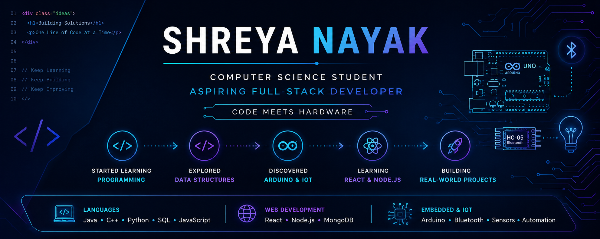

  

<h1 align="center">Hey! I'm Shreya 👋</h1>

Curious developer • Creative problem solver • Lifelong learner

## 👩‍💻 About Me

I'm a Computer Science student who enjoys turning ideas into real projects.

Whether it's building web applications, experimenting with Arduino-based automation, or exploring new technologies, I love learning by creating.

I'm currently expanding my skills in React, Node.js and MongoDB while continuously improving my problem-solving abilities through hands-on development.

Outside of coding, I enjoy playing table tennis, which has taught me discipline, focus and the value of consistent practice.
